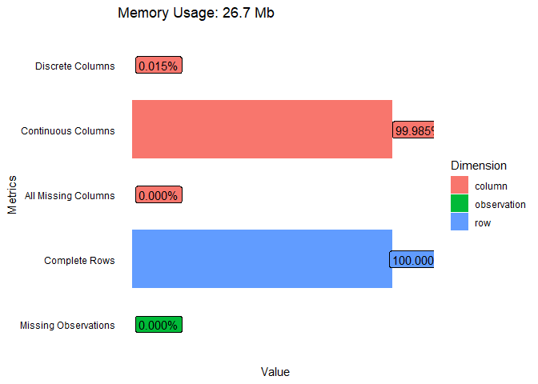
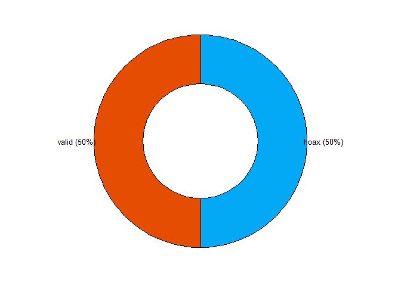
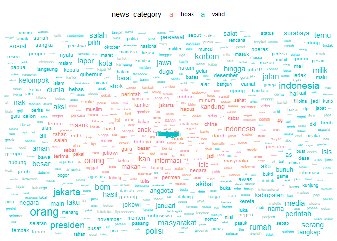
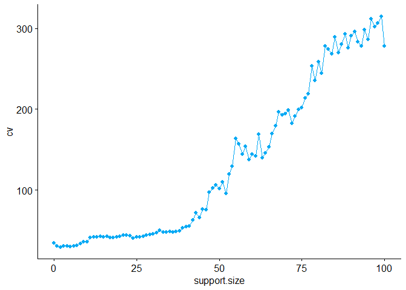
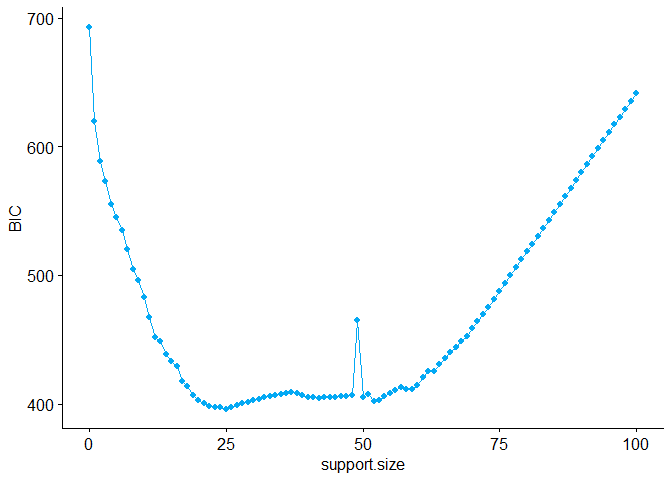
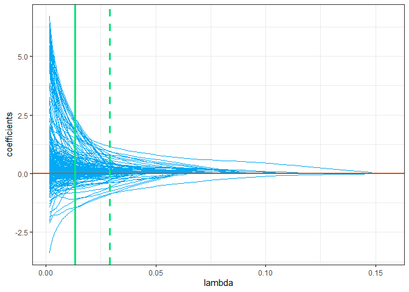
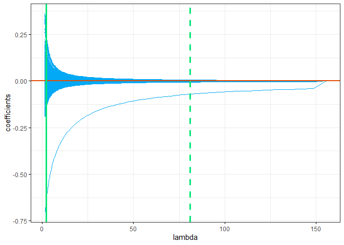

Variable Selection Analysis on Indonesian Hoax News Dataset
================
AhmedLubis
2026-08-15

# ==============================================================================

# 1. LOAD LIBRARIES

# ==============================================================================

``` r
library(tidyverse)
```

    ## Warning: package 'tidyverse' was built under R version 4.5.3

    ## Warning: package 'ggplot2' was built under R version 4.5.3

    ## Warning: package 'purrr' was built under R version 4.5.3

    ## Warning: package 'dplyr' was built under R version 4.5.3

    ## ── Attaching core tidyverse packages ──────────────────────── tidyverse 2.0.0 ──
    ## ✔ dplyr     1.2.1     ✔ readr     2.1.6
    ## ✔ forcats   1.0.1     ✔ stringr   1.6.0
    ## ✔ ggplot2   4.0.3     ✔ tibble    3.3.1
    ## ✔ lubridate 1.9.5     ✔ tidyr     1.3.2
    ## ✔ purrr     1.2.2     
    ## ── Conflicts ────────────────────────────────────────── tidyverse_conflicts() ──
    ## ✖ dplyr::filter() masks stats::filter()
    ## ✖ dplyr::lag()    masks stats::lag()
    ## ℹ Use the conflicted package (<http://conflicted.r-lib.org/>) to force all conflicts to become errors

``` r
library(vroom)
```

    ## 
    ## Attaching package: 'vroom'
    ## 
    ## The following objects are masked from 'package:readr':
    ## 
    ##     as.col_spec, col_character, col_date, col_datetime, col_double,
    ##     col_factor, col_guess, col_integer, col_logical, col_number,
    ##     col_skip, col_time, cols, cols_condense, cols_only, date_names,
    ##     date_names_lang, date_names_langs, default_locale, fwf_cols,
    ##     fwf_empty, fwf_positions, fwf_widths, locale, output_column,
    ##     problems, spec

``` r
library(skimr)
```

    ## Warning: package 'skimr' was built under R version 4.5.3

``` r
library(DataExplorer)
```

    ## Warning: package 'DataExplorer' was built under R version 4.5.3

``` r
library(ggwordcloud)
```

    ## Warning: package 'ggwordcloud' was built under R version 4.5.3

``` r
library(ggpubr)
library(abess)
```

    ## Warning: package 'abess' was built under R version 4.5.3

    ## 
    ##  Thank you for using abess! To acknowledge our work, please cite the package:
    ## 
    ##  Zhu J, Wang X, Hu L, Huang J, Jiang K, Zhang Y, Lin S, Zhu J (2022). 'abess: A Fast Best Subset Selection Library in Python and R.' Journal of Machine Learning Research, 23(202), 1-7. https://www.jmlr.org/papers/v23/21-1060.html.
    ## 
    ## Attaching package: 'abess'
    ## 
    ## The following object is masked from 'package:tidyr':
    ## 
    ##     extract

``` r
library(glmnetUtils)
```

    ## Warning: package 'glmnetUtils' was built under R version 4.5.3

``` r
library(broom)
library(tictoc)
```

    ## Warning: package 'tictoc' was built under R version 4.5.3

# ==============================================================================

# 2. IMPORT & PREPROCESS DATA

# ==============================================================================

``` r
hoax_news <- vroom("hoax_news_indonesia_postprocess.csv", delim = ",")
```

    ## Rows: 500 Columns: 6685
    ## ── Column specification ────────────────────────────────────────────────────────
    ## Delimiter: ","
    ## chr    (1): news_category
    ## dbl (6684): a, aa, aam, aamiin, ababa, abad, abai, abang, abbas, abdi, abdu,...
    ## 
    ## ℹ Use `spec()` to retrieve the full column specification for this data.
    ## ℹ Specify the column types or set `show_col_types = FALSE` to quiet this message.

``` r
dim_desc(hoax_news)
```

    ## [1] "[500 x 6,685]"

``` r
# Exploratory data structure check
hoax_news[, 1:20]
```

    ## # A tibble: 500 × 20
    ##    news_category     a    aa   aam aamiin ababa  abad  abai abang abbas  abdi
    ##    <chr>         <dbl> <dbl> <dbl>  <dbl> <dbl> <dbl> <dbl> <dbl> <dbl> <dbl>
    ##  1 valid             0     0     0      0     0     0     0     0     0     0
    ##  2 valid             0     0     0      0     0     0     0     0     0     0
    ##  3 valid             0     0     0      0     0     0     0     0     0     0
    ##  4 valid             0     0     0      0     0     0     0     0     0     0
    ##  5 valid             0     0     0      0     0     0     0     0     0     0
    ##  6 valid             0     0     0      0     0     0     0     0     0     0
    ##  7 valid             0     0     0      0     0     0     0     0     0     0
    ##  8 valid             0     0     0      0     0     0     0     0     0     0
    ##  9 valid             0     0     1      0     0     0     0     0     0     0
    ## 10 valid             0     0     0      0     0     0     0     0     0     0
    ## # ℹ 490 more rows
    ## # ℹ 9 more variables: abdu <dbl>, abdul <dbl>, abdulaziz <dbl>,
    ## #   abdulkadir <dbl>, abdulkarim <dbl>, abdullah <dbl>, abdulrachman <dbl>,
    ## #   abdurrahman <dbl>, abedi <dbl>

``` r
# Convert response variable to factor
hoax_news <- hoax_news %>%
  mutate(news_category = factor(news_category, levels = c("hoax", "valid")))
```

# ==============================================================================

# 3. EXPLORATORY DATA ANALYSIS (EDA) & VISUALIZATION

# ==============================================================================

``` r
# Overview plot
plot_intro(
  hoax_news,
  theme_config = theme(
    axis.line = element_blank(),
    axis.ticks = element_blank(),
    axis.text.x = element_blank()
  ),
  geom_label_args = list(nudge_y = 0.1),
  ggtheme = theme_classic()
)
```

<!-- -->

``` r
# Target Variable Distribution
hoax_news %>%
  count(news_category) %>%
  mutate(percentage = round((n * 100) / sum(n), 2)) %>%
  mutate(labs = paste0(news_category, " (", percentage, "%)")) %>%
  ggdonutchart(
    x = "percentage",
    label = "labs",
    fill = c("#03A9F4", "#E54D03"),
    lab.pos = "out"
  )
```

<!-- -->

``` r
# Wordcloud Generation
hoax_news_longer <- hoax_news %>%
  pivot_longer(-news_category, names_to = "Token", values_to = "BOW")

hoax_news_longer %>%
  group_by(news_category, Token) %>%
  summarize(BOW = sum(BOW), .groups = "drop") %>%
  filter(BOW > 10) %>%
  ggplot() +
  geom_text_wordcloud(
    aes(label = Token, size = BOW, color = news_category), 
    show.legend = TRUE
  ) +
  scale_size(guide = "none") +
  theme_minimal() +
  theme(legend.position = "top")
```

    ## Warning in wordcloud_boxes(data_points = points_valid_first, boxes = boxes, :
    ## Some words could not fit on page. They have been placed at their original
    ## positions.

<!-- -->

``` r
rm(hoax_news_longer)
```

# ==============================================================================

# 4. FORWARD SELECTION MODELING (abess)

# ==============================================================================

``` r
# 4.1 Cross-Validation (CV)
tic()
model_forward_cv <- abess(
  formula = news_category ~ .,
  data = hoax_news,
  support.size = 0:100,
  family = "binomial",
  tune.type = "cv",
  nfolds = 10,
  newton = "exact",
  seed = 2045
)
toc()
```

    ## 42.91 sec elapsed

``` r
# 4.2 BIC Metric
tic()
model_forward_bic <- abess(
  formula = news_category ~ .,
  data = hoax_news,
  support.size = 0:100,
  family = "binomial",
  tune.type = "bic",
  screening.num = 1000,
  newton = "exact",
  seed = 2045
)
toc()
```

    ## 18.08 sec elapsed

``` r
# Extract tuning tables and find optimal models
forward_cv_df  <- print(model_forward_cv)
```

    ## Call:
    ## abess.formula(formula = news_category ~ ., data = hoax_news, 
    ##     support.size = 0:100, family = "binomial", tune.type = "cv", 
    ##     nfolds = 10, newton = "exact", seed = 2045)
    ## 
    ##     support.size        dev        cv
    ## 1              0  346.57359  34.79437
    ## 2              1  306.69291  30.81729
    ## 3              2  288.21224  29.05936
    ## 4              3  278.62384  31.04790
    ## 5              4  268.26905  30.41896
    ## 6              5  260.25990  30.25824
    ## 7              6  254.65430  30.66841
    ## 8              7  243.45784  31.66854
    ## 9              8  235.54518  33.94086
    ## 10             9  230.66140  35.91515
    ## 11            10  208.89046  36.12297
    ## 12            11 1743.35879  41.09154
    ## 13            12 1702.33709  41.82161
    ## 14            13 1578.62285  42.15469
    ## 15            14  182.58405  42.46708
    ## 16            15  264.37811  41.95216
    ## 17            16  166.65488  42.66658
    ## 18            17 1198.50164  41.38424
    ## 19            18 1668.22071  41.56120
    ## 20            19 1864.81507  41.96996
    ## 21            20 1332.06189  42.59268
    ## 22            21 1192.44229  43.83438
    ## 23            22 2027.18080  44.09553
    ## 24            23  562.96460  43.57369
    ## 25            24  144.12141  40.30307
    ## 26            25  144.12074  41.92459
    ## 27            26 1771.99105  42.26262
    ## 28            27  875.93754  42.62318
    ## 29            28 1779.17990  43.84707
    ## 30            29 1995.59043  45.17909
    ## 31            30 1077.25658  45.48665
    ## 32            31 2331.88867  46.85345
    ## 33            32  909.77909  50.23286
    ## 34            33  126.29655  47.65554
    ## 35            34  577.83758  47.99329
    ## 36            35  925.68014  48.30478
    ## 37            36 1086.74442  48.26313
    ## 38            37  609.14042  48.80439
    ## 39            38  787.97903  49.50665
    ## 40            39 2754.06163  53.37188
    ## 41            40 3528.22530  54.60610
    ## 42            41 8914.91438  55.04328
    ## 43            42 8667.80531  63.18523
    ## 44            43 1804.73742  71.80295
    ## 45            44 3057.79285  66.01468
    ## 46            45  923.62930  76.27899
    ## 47            46 2533.90356  75.93013
    ## 48            47 2312.65517  97.59892
    ## 49            48 8426.19007 102.15729
    ## 50            49 8282.36337 106.52456
    ## 51            50 7937.35253 101.48044
    ## 52            51 1081.61672 110.16772
    ## 53            52 2614.59111  95.97873
    ## 54            53 1197.37749 119.39648
    ## 55            54  628.11897 129.29849
    ## 56            55  800.41364 163.62678
    ## 57            56 1154.77963 156.91836
    ## 58            57 1042.77215 144.35760
    ## 59            58  636.04940 153.75769
    ## 60            59  474.79319 137.38409
    ## 61            60  604.97841 144.51136
    ## 62            61  796.91163 142.07317
    ## 63            62  886.02693 168.96516
    ## 64            63  795.38832 139.86514
    ## 65            64  454.76178 146.09762
    ## 66            65 1417.41655 153.12746
    ## 67            66  579.66638 169.80503
    ## 68            67   27.47450 179.54275
    ## 69            68  179.26805 196.33912
    ## 70            69  370.09630 192.83700
    ## 71            70  777.61766 194.24199
    ## 72            71  997.84926 199.07915
    ## 73            72 1622.63714 182.59718
    ## 74            73 1394.65195 191.74050
    ## 75            74 1510.13032 199.75552
    ## 76            75  409.03057 201.95820
    ## 77            76  603.74220 213.72349
    ## 78            77  312.63686 219.23769
    ## 79            78 1024.43870 253.07118
    ## 80            79  617.12372 235.44056
    ## 81            80 1522.05125 258.40999
    ## 82            81  648.62304 244.50676
    ## 83            82 1020.26507 278.25971
    ## 84            83  251.79153 274.17825
    ## 85            84  404.16195 268.65671
    ## 86            85  787.00862 289.48403
    ## 87            86  398.16125 270.05591
    ## 88            87  902.12045 280.16113
    ## 89            88  426.10678 292.84567
    ## 90            89  910.18754 275.98914
    ## 91            90   32.06498 290.94527
    ## 92            91  256.08438 295.96184
    ## 93            92  526.12553 282.97220
    ## 94            93  108.12520 277.98817
    ## 95            94   34.39854 298.12701
    ## 96            95  340.80979 285.97918
    ## 97            96   34.48599 311.90513
    ## 98            97  642.79313 301.79003
    ## 99            98  201.98109 306.55948
    ## 100           99  592.85104 315.00710
    ## 101          100   92.44684 277.82918

``` r
forward_bic_df <- print(model_forward_bic)
```

    ## Call:
    ## abess.formula(formula = news_category ~ ., data = hoax_news, 
    ##     support.size = 0:100, family = "binomial", tune.type = "bic", 
    ##     screening.num = 1000, newton = "exact", seed = 2045)
    ## 
    ##     support.size       dev      BIC
    ## 1              0 346.57359 693.1472
    ## 2              1 306.69339 619.6014
    ## 3              2 288.21283 588.8549
    ## 4              3 277.36751 573.3789
    ## 5              4 265.06298 554.9844
    ## 6              5 256.97712 545.0273
    ## 7              6 248.69217 534.6720
    ## 8              7 238.18828 519.8788
    ## 9              8 227.65838 505.0336
    ## 10             9 219.98662 495.9047
    ## 11            10 210.27569 482.6975
    ## 12            11 199.62412 467.6089
    ## 13            12 188.61849 451.8123
    ## 14            13 183.75963 448.3092
    ## 15            14 175.92678 438.8581
    ## 16            15 170.10285 433.4248
    ## 17            16 164.77494 428.9836
    ## 18            17 155.80512 417.2586
    ## 19            18 150.96406 413.7911
    ## 20            19 144.39841 406.8744
    ## 21            20 139.23086 402.7539
    ## 22            21 135.05980 400.6264
    ## 23            22 130.77847 398.2783
    ## 24            23 127.19368 397.3233
    ## 25            24 124.21523 397.5811
    ## 26            25 120.11439 395.5940
    ## 27            26 117.79698 397.1738
    ## 28            27 115.44392 398.6823
    ## 29            28 113.05414 400.1173
    ## 30            29 110.62418 401.4720
    ## 31            30 108.15360 402.7454
    ## 32            31 105.63947 403.9318
    ## 33            32 103.08147 405.0304
    ## 34            33 100.47457 406.0312
    ## 35            34  97.81782 406.9323
    ## 36            35  95.09584 407.7030
    ## 37            36  92.33097 408.3878
    ## 38            37  89.50582 408.9521
    ## 39            38  86.14484 408.4448
    ## 40            39  82.22991 406.8295
    ## 41            40  78.20581 404.9959
    ## 42            41  75.09136 404.9817
    ## 43            42  71.57594 404.1654
    ## 44            43  69.06494 405.3580
    ## 45            44  65.75392 404.9506
    ## 46            45  62.54121 404.7398
    ## 47            46  59.95270 405.7774
    ## 48            47  57.07106 406.2287
    ## 49            48  53.99989 406.3010
    ## 50            49  80.32212 465.1600
    ## 51            50  47.02401 404.7784
    ## 52            51  45.09709 407.1392
    ## 53            52  39.27377 401.7072
    ## 54            53  36.65580 402.6858
    ## 55            54  35.16289 405.9146
    ## 56            55  33.25527 408.3140
    ## 57            56  31.35618 410.7304
    ## 58            57  29.42200 413.0767
    ## 59            58  25.49061 411.4285
    ## 60            59  22.15022 410.9623
    ## 61            60  20.93391 414.7443
    ## 62            61  20.87790 420.8469
    ## 63            62  20.05029 425.4063
    ## 64            63  17.02047 425.5612
    ## 65            64  16.32575 430.3864
    ## 66            65  15.69915 435.3478
    ## 67            66  15.11704 440.3982
    ## 68            67  13.69924 443.7772
    ## 69            68  13.17164 448.9366
    ## 70            69  11.98049 452.7689
    ## 71            70  11.70587 458.4343
    ## 72            71  11.44563 464.1284
    ## 73            72  11.10802 469.6678
    ## 74            73  10.76368 475.1937
    ## 75            74  10.72588 481.3328
    ## 76            75  10.68385 487.4633
    ## 77            76  10.65372 493.6177
    ## 78            77  10.61646 499.7577
    ## 79            78  10.59323 505.9259
    ## 80            79  10.56977 512.0936
    ## 81            80  10.54587 518.2604
    ## 82            81  10.52162 524.4265
    ## 83            82  10.48980 530.5775
    ## 84            83  10.46383 536.7401
    ## 85            84  10.43173 542.8905
    ## 86            85  10.40376 549.0492
    ## 87            86  10.40300 555.2623
    ## 88            87  10.36580 561.4025
    ## 89            88  10.34660 567.5787
    ## 90            89  10.32719 573.7545
    ## 91            90  10.31733 579.9494
    ## 92            91  10.29739 586.1241
    ## 93            92  10.27722 592.2984
    ## 94            93  10.25649 598.4715
    ## 95            94  10.23532 604.6438
    ## 96            95  10.23530 610.8584
    ## 97            96  10.21382 617.0300
    ## 98            97  10.19172 623.2004
    ## 99            98  10.18079 629.3932
    ## 100           99  10.16925 635.5847
    ## 101          100  10.15776 641.7763

``` r
best_forward_cv  <- forward_cv_df %>% slice_min(order_by = cv)
best_forward_bic <- forward_bic_df %>% slice_min(order_by = BIC)

# Plotting metrics across support sizes
forward_cv_df %>%
  ggline(x = "support.size", y = "cv", color = "#03A9F4", add = "point")
```

<!-- -->

``` r
forward_bic_df %>%
  ggline(x = "support.size", y = "BIC", color = "#03A9F4", add = "point")
```

<!-- -->

``` r
# 4.3 Coefficients Interpretation (Forward CV)
coef_forward_cv <- coef(
  model_forward_cv, 
  sparse = FALSE, 
  support.size = best_forward_cv$support.size
) %>%
  as.data.frame() %>%
  rownames_to_column(var = "Variables") %>%
  rename_with(~str_replace(.x, pattern = "\\d+", "coefficients")) %>%
  filter(coefficients != 0) %>%
  mutate(odds_ratio = round(exp(coefficients), 3)) %>%
  arrange(desc(odds_ratio))
```

# ==============================================================================

# 5. REGRESSION WITH LASSO PENALTY (alpha = 1)

# ==============================================================================

``` r
# 5.1 Model Fitting
tic()
set.seed(2045)
model_lasso_dev <- cv.glmnet(
  news_category ~ ., data = hoax_news, alpha = 1,
  type.measure = "deviance", family = "binomial", nfolds = 10
)
toc()
```

    ## 13.86 sec elapsed

``` r
tic()
set.seed(2045)
model_lasso_auc <- cv.glmnet(
  news_category ~ ., data = hoax_news, alpha = 1,
  type.measure = "auc", family = "binomial", nfolds = 10
)
toc()
```

    ## 16.16 sec elapsed

``` r
# Extract Best Lambdas
best_lambda_lasso_dev <- glance(model_lasso_dev)
best_lambda_lasso_auc <- glance(model_lasso_auc)

# 5.2 Coefficient Path Plot (Fixed Deprecated 'size' to 'linewidth')
plot_coef_lasso_dev <- tidy(model_lasso_dev$glmnet.fit) %>%
  ggline(
    x = "lambda", y = "estimate", group = "term",
    numeric.x.axis = TRUE, plot_type = "l",
    linewidth = 0.5, color = "#03A9F4", ggtheme = theme_bw(),
    ylab = "coefficients"
  ) +
  geom_hline(yintercept = 0, color = "#E54D03", linewidth = 1) +
  geom_vline(xintercept = best_lambda_lasso_dev$lambda.min, 
             color = "#00E676", linewidth = 1.25) +
  geom_vline(xintercept = best_lambda_lasso_dev$lambda.1se, lty = 2, 
             color = "#00E676", linewidth = 1.25)

plot_coef_lasso_dev
```

<!-- -->

``` r
# 5.3 Coefficients Extraction at 1SE
coef_best_lasso_auc <- coef(model_lasso_auc, s = "lambda.1se") %>%
  as.matrix() %>%
  as.data.frame() %>%
  rownames_to_column(var = "term") %>%
  rename(coefficients = 2) %>%
  filter(coefficients != 0) %>%
  mutate(odds_ratio = round(exp(coefficients), 3)) %>%
  arrange(desc(coefficients))
```

# ==============================================================================

# 6. REGRESSION WITH RIDGE PENALTY (alpha = 0)

# ==============================================================================

``` r
# 6.1 Model Fitting
tic()
set.seed(2045)
model_ridge_dev <- cv.glmnet(
  news_category ~ ., data = hoax_news, alpha = 0,
  type.measure = "deviance", family = "binomial", nfolds = 10
)
toc()
```

    ## 92.94 sec elapsed

``` r
tic()
set.seed(2045)
model_ridge_auc <- cv.glmnet(
  news_category ~ ., data = hoax_news, alpha = 0,
  type.measure = "auc", family = "binomial", nfolds = 10
)
toc()
```

    ## 94.86 sec elapsed

``` r
# Extract Best Lambdas
best_lambda_ridge_dev <- glance(model_ridge_dev)
best_lambda_ridge_auc <- glance(model_ridge_auc)

# 6.2 Coefficients Path Plot (Fixed Deprecated 'size' to 'linewidth')
plot_coef_ridge_auc <- tidy(model_ridge_auc$glmnet.fit) %>%
  ggline(
    x = "lambda", y = "estimate", group = "term",
    numeric.x.axis = TRUE, plot_type = "l",
    linewidth = 0.5, color = "#03A9F4", ggtheme = theme_bw(),
    ylab = "coefficients"
  ) +
  geom_hline(yintercept = 0, color = "#E54D03", linewidth = 1) +
  geom_vline(xintercept = best_lambda_ridge_auc$lambda.min, 
             color = "#00E676", linewidth = 1.25) +
  geom_vline(xintercept = best_lambda_ridge_auc$lambda.1se, lty = 2, 
             color = "#00E676", linewidth = 1.25)

plot_coef_ridge_auc
```

<!-- -->

``` r
# 6.3 Coefficients Extraction at 1SE
coef_best_ridge_auc <- coef(model_ridge_auc, s = "lambda.1se") %>%
  as.matrix() %>%
  as.data.frame() %>%
  rownames_to_column(var = "term") %>%
  rename(coefficients = 2) %>%
  filter(coefficients != 0) %>%
  mutate(odds_ratio = round(exp(coefficients), 3)) %>%
  arrange(desc(coefficients))
```

# ==============================================================================

# 7. MODEL COMPARISON (LASSO vs RIDGE by AUC)

# ==============================================================================

``` r
model_comparison <- tidy(model_lasso_auc) %>%
  filter(abs(lambda - best_lambda_lasso_auc$lambda.1se) < 1e-6) %>%
  bind_rows(
    tidy(model_ridge_auc) %>%
      filter(abs(lambda - best_lambda_ridge_auc$lambda.1se) < 1e-6)
  ) %>%
  select(lambda, estimate, nzero) %>%
  mutate(Nama_Model = c("LASSO", "RIDGE")) %>%
  relocate(Nama_Model) %>%
  rename("mean_AUC" = estimate)

print(model_comparison)
```

    ## # A tibble: 2 × 4
    ##   Nama_Model  lambda mean_AUC nzero
    ##   <chr>        <dbl>    <dbl> <int>
    ## 1 LASSO       0.0253    0.902   146
    ## 2 RIDGE      81.1       0.937  6684

# ==============================================================================

# 8. PREDICTION ON NEW DATA

# ==============================================================================

``` r
set.seed(2045)
new_data <- hoax_news %>%
  slice_sample(n = 3, by = news_category) %>%
  select(-news_category)

# Predict with LASSO
pred_lasso <- predict(
  object = model_lasso_auc,
  newdata = new_data,
  type = "response",
  s = "lambda.1se"
) %>%
  as_tibble() %>%
  rename(prob_pred = lambda.1se) %>%
  mutate(
    pred_class = if_else(prob_pred > 0.5, "hoax", "valid"),
    pred_class = factor(pred_class, levels = c("hoax", "valid"))
  )

print(pred_lasso)
```

    ## # A tibble: 6 × 2
    ##   prob_pred pred_class
    ##       <dbl> <fct>     
    ## 1     0.743 hoax      
    ## 2     0.993 hoax      
    ## 3     0.831 hoax      
    ## 4     0.277 valid     
    ## 5     0.165 valid     
    ## 6     0.277 valid

``` r
# Predict with Ridge
pred_ridge <- predict(
  object = model_ridge_auc,
  newdata = new_data,
  type = "response",
  s = "lambda.min"
) %>%
  as_tibble() %>%
  rename(prob_pred = lambda.min) %>%
  mutate(
    pred_class = if_else(prob_pred > 0.5, "hoax", "valid"),
    pred_class = factor(pred_class, levels = c("hoax", "valid"))
  )

print(pred_ridge)
```

    ## # A tibble: 6 × 2
    ##   prob_pred pred_class
    ##       <dbl> <fct>     
    ## 1     0.902 hoax      
    ## 2     0.885 hoax      
    ## 3     0.793 hoax      
    ## 4     0.249 valid     
    ## 5     0.304 valid     
    ## 6     0.246 valid
